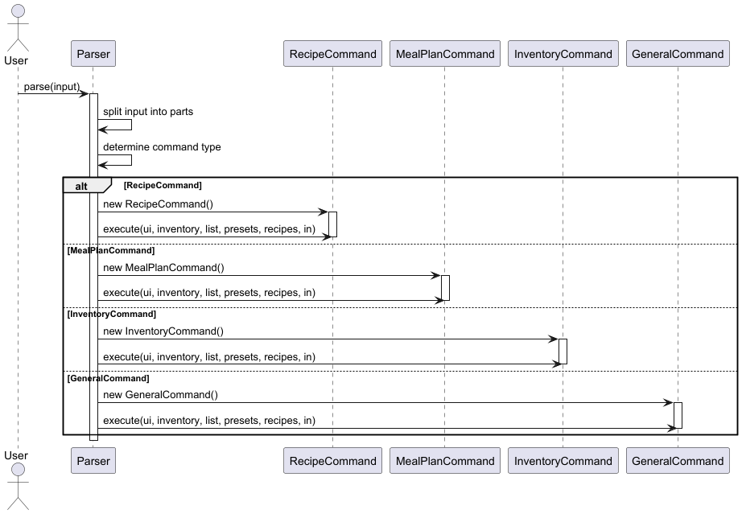
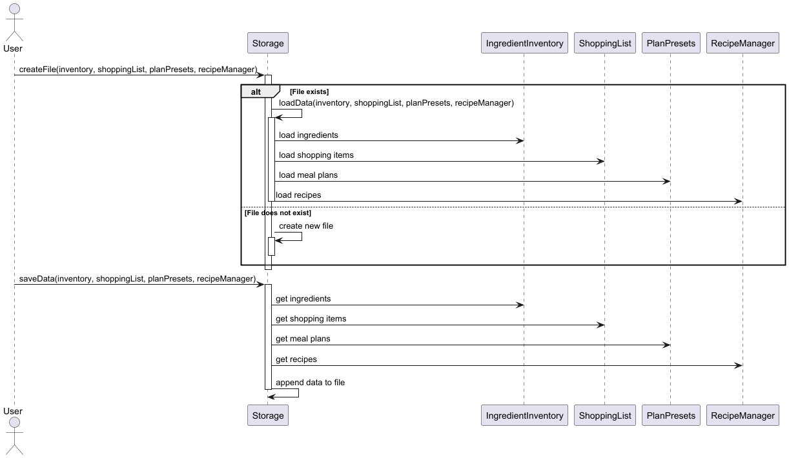
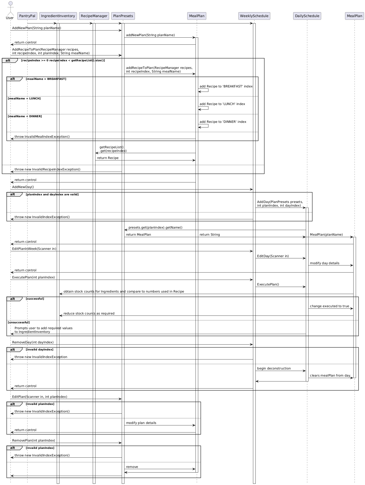

# Developer Guide

## Acknowledgements

{list here sources of all reused/adapted ideas, code, documentation, and third-party libraries -- include links to the original source as well}

## Design & implementation

{Describe the design and implementation of the product. Use UML diagrams and short code snippets where applicable.}

## Product scope
### Target user profile

{Describe the target user profile}

### Value proposition

{Describe the value proposition: what problem does it solve?}

## User Stories

|Version| As a ... | I want to ... | So that I can ...|
|--------|----------|---------------|------------------|
|v1.0|new user|see usage instructions|refer to them when I forget how to use the application|
|v2.0|user|find a to-do item by name|locate a to-do without having to go through the entire list|

## Non-Functional Requirements

{Give non-functional requirements}

## Glossary

* *glossary item* - Definition

## Instructions for manual testing

{Give instructions on how to do a manual product testing e.g., how to load sample data to be used for testing}

# Implementation of Command Classes

## Overview
The Command classes are responsible for encapsulating the logic and parameters associated with each command in the application.

## Design and Implementation
The Command classes are designed to be modular and expandable, allowing for easy addition of new commands and functionalities.
The core components of the Command classes include:
1. **Command Classes**: Each command is represented by a separate class, which encapsulates the logic and parameters associated with that command. This design allows for clear separation of concerns and makes it easy to add new commands in the future.
2. **Command Types**: Each command inherits from a specific command type, which is used to identify the command's functionality group. This allows for better organization and management of commands within the application.
2. **Execute Method**: Each command class implements an `execute` method, which contains the logic for performing the action associated with that command. This method is called when the parser returns the command object to the main program.

# Class Diagram

# Implementation of the Parser Feature

## Overview
The Parser feature is a crucial component of the application, responsible for interpreting and processing user input.
It serves as the bridge between the user interface and the underlying logic of the application, ensuring that commands are correctly understood and executed.

## Design and Implementation
The Parser feature is designed to be modular and extensible, allowing for easy addition of new commands and functionalities. The core components of the Parser feature include:
1. **Command Classes**: Each command is represented by a separate class, which encapsulates the logic and parameters associated with that command. This design allows for clear separation of concerns and makes it easy to add new commands in the future.

2. **Parser Class**: The `Parser` class is responsible for parsing the user input and instantiating the appropriate command class. It uses a series of `switch` statements to determine the type of command based on the input string.

3. **Command Execution**: Once the command is parsed and instantiated, it is executed by calling the `execute` method on the command object. This method contains the logic for performing the action associated with the command.

4. **Error Handling**: The Parser feature includes error handling to manage invalid input and provide feedback to the user. If the input cannot be parsed or if the command is not recognized, an appropriate error message is displayed.

# Sequence Diagram

The following sequence diagram illustrates the interaction between the user, the `Parser`, and the `Command` classes during the execution of a command:

### Why It Is Implemented This Way
By using separate command classes, we can easily extend the functionality of the application without modifying the core parsing logic.
By encapsulating the command logic within individual classes, we adhere to the Single Responsibility Principle, making the codebase easier to understand and maintain.

# Implementation of the Storage Feature

## Overview

The Storage feature is responsible for managing the persistence of data when the application exits. It handles the reading
and writing of data to and from `data.txt`, ensuring that user data is saved and can be retrieved when the application is relaunched

## Design and Implementation

The Storage feature is designed to be modular and extensible, allowing for easy addition of new data types and functionalities. The core components of the Storage feature include:
1. **Storage Class**: The `Storage` class is responsible for managing the reading and writing of data to and from `data.txt`. It provides methods for loading data from the file and saving data back to the file.
2. **Data Classes**: The Storage feature interacts with various data classes, such as `IngredientInventory`, `ShoppingList`, `RecipeManager`, and `PlanPresets`. Each of these classes represents a specific type of data list and provides methods for manipulating that list.
3. **File Handling**: The Storage feature uses file handling techniques to read and write data to `data.txt`. It ensures that the data is formatted correctly and that any errors during file operations are handled gracefully.

# Sequence Diagram

The following sequence diagram illustrates the interaction between the `Storage` class and the other key lists in the application during the loading and saving of data:
The key lists include: `StockList`, `LowStockList`, `RecipeList`, `ShoppingList`

# Implementation of the Meal Plan, Plan Presets and Viewing features

## Meal Plan Feature

### Overview
The Meal Plan feature is the core feature of the PantryPal application, and is responsible for the cohesion of the
Recipe and IngredientInventory features. A Meal Plan instance encapsulates the meals attribute, which holds the recipes
used by that meal plan. Each Meal Plan instance is created and stored in an overarching PlanPresets instance, and is
used to instantiate a DailySchedule instance for purposes of viewing.

### Design and Implementation
The MealPlan feature is designed for quick interfacing and adaptation of a user's plans. It allows the user to quickly
modify their plans for any particular day using the given methods.

- **MealPlan Class**: Represents a meal plan instance created by the user with attributes for an identifying name and used recipes. It includes the methods to add, edit and remove certain recipes from the plan.

### Core Functionalities
- **Add Recipe to Plan**: allows the user to add a particular created recipe into a meal plan, through specification by the user on whether it is for breakfast, lunch or dinner.
- **Remove Recipe from Plan**: allows the user to completely remove a selected recipe from a meal plan.

## Plan Presets Feature

The Plan Presets feature holds a collection of meal plans that can be quickly added to a DailySchedule instance for
quick re-iterations of a same meal plan. It encapsulates an ArrayList of plans that have been created by the user, and draws
from this to substantiate a DailySchedule instance with a created meal plan.

### Design and Implementation
The Plan Presets feature is designed for convenience, allowing the user to re-use a same plan for purposes of
a diet, without having to painstakingly enter the details for every duplicate meal plan they are planning to add to their
viewing schedule.

- **PlanPresets Class**: Represents an individual set of meal plans created by the user that contains the collection of plans.
- **Find Plan feature**: Allows the user to locate a plan with a particular name through matching of string contents.

### Core Functionalities
- **Add Plan**: Instantiates a new Meal Plan instance with a name optionally keyed by the user
- **Remove Plan**: Removes a plan from the currently created preset
- **Add recipe to plan**: Facilitates the procedure of adding a recipe to the indicated meal plan as decided by the user
- **Remove recipe from plan**: Facilitates the procedure of removing a recipe from the indicated meal plan as decided by the user

## Viewing Features

### Overview
The Viewing features includes WeeklySchedule and DailySchedule, which provide the user with a packaged view of the
summarised contents of a meal plan assigned to a particular day of the week (in the case of WeeklySchedule), and the
detailed view of a meal plan (in the case of DailySchedule).

## DailySchedule Feature

Provides the user with a proper interface to consolidate their meal plans for a particular day and execute upon them to
indicate the completion of the meal plan.

### Design and Implementation

- **DailySchedule Class**: Represents the individual day that a user plans for, with functionalities to modify details of the selected plan as necessary.
- **Execute Plan Feature**: Attempts to remove the ingredients used by the meal plan from the inventory, and marks the plan as acted upon. If insufficient items are in the inventory, prompts the user with the missing ingredients before allowing execution

### Core Functionalities
- **Set Plan** Select a plan to duplicate from and assign to the dailySchedule
- **Remove Plan** Remove the current selected plan from dailySchedule
- **Execute Plan** Marks the plan as done and reduces the stock of ingredients used by the plan. Does not execute if there is a lack in count for any ingredient, and will prompt the user with all missing ingredients
- **Edit Plan** Able to pick from any detail amongst the plan to modify
- **View Plan** Able to view the full details of the plan, including the content of each meal's recipe

## WeeklySchedule Feature

Provides the user with an interface to interact with each individual DailySchedule for a weekly plan. 

### Design and Implementation

- **DailySchedule Class**: Represents the individual day that a user plans for, with functionalities to modify details of the selected plan as necessary.
- **Execute Plan Feature**: Attempts to remove the ingredients used by the meal plan from the inventory, and marks the plan as acted upon. If insufficient items are in the inventory, prompts the user with the missing ingredients before allowing execution

### Core Functionalities
- **Set Plan** Select a plan to duplicate from and assign to the dailySchedule
- **Remove Plan** Remove the current selected plan from dailySchedule
- **Execute Plan** Marks the plan as done and reduces the stock of ingredients used by the plan. Does not execute if there is a lack in count for any ingredient, and will prompt the user with all missing ingredients
- **Edit Plan** Able to pick from any detail amongst the plan to modify
- **View Plan** Shows a summarized view of the meal plans in each DailySchedule

### Sequence Diagram

The following sequence diagram illustrates the interactions between the user, PlanPreset, each MealPlan within
PlanPreset, DailySchedule, WeeklySchedule, each MealPlan within DailySchedule, IngredientInventory and each Recipe
amongst all created MealPlan 

# Implementation of the Ingredient and Ingredient Inventory Features

## Ingredient Feature

### Overview
The Ingredient feature represents individual ingredients in the system. Each ingredient instance encapsulates essential
attributes such as name, quantity, and unit. This modular design ensures that ingredients can be easily created,
modified, and retrieved when needed.

### Design and Implementation
The Ingredient feature is designed for flexibility and accuracy, ensuring seamless interaction with other components
like the Ingredient Inventory, Recipe, and Recipe Manager. The core components of the Ingredient feature include:

- **Ingredient Class**: Represents an individual ingredient with attributes for name, quantity, and unit. It includes methods to get and set these attributes, ensuring proper data encapsulation.
- **Unit Feature**: Standardizes measurement units for ingredients, ensuring consistency.

### Core Functionalities
- **Creating Ingredient**: Allows creating ingredients with specified attributes.
- **Updating Ingredient**: Provides methods to modify an ingredient's name, quantity, and unit.
- **Unit Management**: Ensures valid unit selection and provides functionality for unit conversion.

## Ingredient Inventory Feature

### Overview
The Ingredient Inventory feature is responsible for managing a collection of ingredients, tracking their quantities, and
ensuring users can monitor their stock. This feature enables users to add, update, and remove ingredients while
supporting low-stock alerts.

### Design and Implementation
The Ingredient Inventory feature is modular and extensible, allowing for seamless integration with features like Recipe
Management and Shopping Lists. The core components of the Ingredient Inventory feature include:

- **Ingredient Inventory Class**: Manages the collection of ingredients, allowing users to add, update, and delete
- items.
- **Low-Stock Alert System**: Enables users to set and retrieve low-stock alerts, notifying them when ingredients fall
- below a set threshold.
- **Integration with Ingredient Feature**: Uses the Ingredient class to ensure consistency and modularity in ingredient
- representation.

### Core Functionalities
- **Adding and Managing Ingredients**: Users can add new ingredients with a name, quantity, and unit while ensuring
- valid input through validation checks.
- **Updating Ingredient Quantities**: The feature allows increasing or decreasing ingredient quantities.
- **Deleting Ingredients**: Users can remove ingredients from the inventory, ensuring accurate stock representation.
- **Low-Stock Alerts**: The system supports configurable alerts to notify users when ingredients are running low.

## Sequence Diagram
The following sequence diagram illustrates the interaction between the user, the Ingredient Inventory, and the
Ingredient feature during ingredient management:

### Why It Is Implemented This Way
The Ingredient and Ingredient Inventory features follow a modular design to ensure flexibility, scalability, and
maintainability. The Single Responsibility Principle is adhered to, with the Ingredient class managing individual
ingredient attributes (name, quantity, unit) and the Ingredient Inventory class handling the collection of ingredients.
This clear separation makes the system easy to understand, maintain, and modify without affecting other components.

# Implementation of the Shopping List Item and Shopping List Features

## Shopping List Item Feature

### Overview
The Shopping List Item feature represents individual items that need to be purchased. Each shopping list item instance encapsulates essential attributes such as ingredient name, quantity needed, and unit of measurement. This modular design ensures that shopping items can be easily created, modified, and tracked.

### Design and Implementation
The Shopping List Item feature is designed for accuracy and consistency, ensuring proper integration with both the Shopping List and Ingredient Inventory features. The core components include:

- **ShoppingListItem Class**: Represents an individual shopping item with attributes for ingredient name, quantity needed, and unit. It includes methods to get and set these attributes, ensuring proper data encapsulation.
- **Unit Consistency**: Maintains consistency with the Unit feature used in the Ingredient class.

### Core Functionalities
- **Creating Shopping Items**: Allows creating shopping items with specified attributes.
- **Updating Shopping Items**: Provides methods to modify an item's quantity and unit.
- **Unit Management**: Ensures valid unit selection and maintains consistency with ingredient units.

## Shopping List Feature

### Overview
The Shopping List feature is responsible for managing a collection of items that need to be purchased. It works in conjunction with the Ingredient Inventory feature to help users track items that are running low or need to be restocked.

### Design and Implementation
The Shopping List feature is modular and extensible, allowing for seamless integration with the Ingredient Inventory and Recipe Management features. The core components include:

- **ShoppingList Class**: Manages the collection of shopping items, allowing users to add, update, and delete items.
- **Automatic Item Generation**: Enables automatic addition of items based on low stock levels in the inventory.
- **Integration with ShoppingListItem**: Uses the ShoppingListItem class to ensure consistency and modularity in item representation.

### Core Functionalities
- **Adding Items**: Users can manually add items to the shopping list or automatically add items based on low stock alerts.
- **Updating Items**: Allows modification of quantities or removal of items from the shopping list.
- **Clearing Items**: Provides functionality to clear the shopping list after items have been purchased.
- **Viewing Items**: Displays a formatted list of items to be purchased, including quantities and units.

## Sequence Diagram
The following sequence diagram illustrates the interaction between the user, Shopping List, Shopping List Item, and Ingredient Inventory when managing shopping items:

### Why It Is Implemented This Way
The Shopping List Item and Shopping List features follow a modular design to ensure flexibility, scalability, and maintainability. The Single Responsibility Principle is adhered to, with the ShoppingListItem class managing individual item attributes and the ShoppingList class handling the collection of items. This clear separation makes the system easy to understand, maintain, and modify without affecting other components.

# Implementation of the Instruction, Recipe and Recipe Management Features

## Instruction Feature

### Overview

The Instruction Feature represents all the instructions in the Recipe. Each instruction instance encapsulates essential attributes such as step number and instruction content. This modular desgin ensures that instructions and instruction list can be easily created, modified, and retrieved when needed.

### Design and Implementation

The Instruction feature is designed for flexibility and accuracy, ensuring seamless interaction with other components like the Recipe and Recipe Manager. The core components of the Ingredient feature include:

- **Instruction Class**: Represents an instruction inside Recipe, with attributes for step number and instruction content. It includes methods to get and set these attributes, ensuring proper data encapsulation.

### Core Functionalities
- **Creating Instruction**: Allows creating instructions with specified attributes.
-**Updating Instruction**: Provides methods to modify an instruction's step number or content.
-**Retrieving Instruction**: Provides methods to return instruction's step number or content for other uses.

## Recipe Feature

The Recipe feature represents individual recipes in the system. Each recipe instance encapsulates essential attributes such as name, instructions, and ingredients. This modular design ensures that recipes can be easily created, modified, and retrieved when needed.

## Design and Implementation
The Recipe feature is designed for flexibility, accuracy and consistency, ensuring proper integration with the Recipe Manager. The core componenets of Recipe feature include:

- **Recipe Class**: Represents an individual recipe with attributes for name, instructions, and ingredients. It includes methods to get and set these attributes, ensuring proper data encapsulation.
- **Integration with Ingredient Class**: Uses the Ingredient class to ensure consistency, accuracy and modularity in the ingredient representation
- **Integration with Instruction Class**: Uses the Instruction class to ensure consistency, accuracy and modularity in the instruction representation

### Core Functionalities
- **Adding and Managing Recipe Ingredients**: Users can add new ingredients with a name, quantity, and unit while ensuring valid input through validation checks.
- **Adding and Managing Recipe Instructions**: Users can add new instructions with a step number and their content.
- **Get Ingredients and Instructions**: Users can retrieve the unique ingredients and instructions associated with a recipe to change their content.
- **Deleting Ingredients**: Users can remove ingredients from the recipe, ensuring accurate recipe information.
- **Deleting Instructions**: Users can remove instructions from the recipe, ensuring accurate recipe information.

## Recipe Management Feature

### Overview
The Recipe Management feature is responsible for managing a collection of recipes, tracking their name, ingredients and instructions. This feature enables users to add recipes, update recipe's ingredients and instructions, and remove recipes.

### Design and Implementation
The Recipe Management feature is modular and extensible, as well as maintaining accuracy, allowing it to be used seamlessly by other features. The core componenets of the Recipe Management feature include:

- **Recipe Manager Class**: Manages the collection of recipes, allowing users to add, remove, or update the recipe's content.
- **Edit Ingredient**: Edits the chosen recipe's ingredient's name, quantity, or unit, ensuring the recipe's accuracy.
- **Edit Instruction**: Edits the chosen recipe's instruction step number or content, ensuring the recipe's accuracy

## Sequence Diagram
The following sequence diagram illustrates the interaction between the user, the Recipe Manager, the Recipe, the Ingredient, and the Instruction feature during recipe management:

### Why It Is Implemented This Way
The Instruction, Recipe, and Recipe Management features follow a modular design to ensure it is easy to be maintained or modified when necessary. The Single Responsibility Principle is adhered to, with Instruction manages only the recipe instructions, while Recipe acts as collection of Instruction and Ingredient, and Recipe Management acts as collection of Instruction only. By separating into smaller classes, it helps the developer understand, maintain without heavy coupling with other components.
